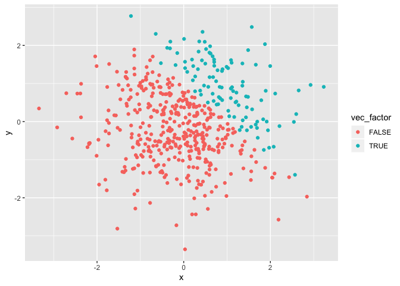

p8105\_hw1new\_yl4358
================
YI LIU
9/20/2019

# Problem 1

Here we create a data frame as instructed in the problem
    1.

``` r
library(tidyverse)
```

    ## ── Attaching packages ─────────────────────────────────────────────────────────────────────────────────── tidyverse 1.2.1 ──

    ## ✔ ggplot2 3.2.1     ✔ purrr   0.3.2
    ## ✔ tibble  2.1.3     ✔ dplyr   0.8.3
    ## ✔ tidyr   0.8.3     ✔ stringr 1.4.0
    ## ✔ readr   1.3.1     ✔ forcats 0.4.0

    ## ── Conflicts ────────────────────────────────────────────────────────────────────────────────────── tidyverse_conflicts() ──
    ## ✖ dplyr::filter() masks stats::filter()
    ## ✖ dplyr::lag()    masks stats::lag()

``` r
first_df = tibble(
  sample = rnorm(8),
  vec_log = sample > 0,
  vec_char = c("My", "name", "is", "YI", "LIU", "and", "study", "biostatistics"),
  vec_factor = factor(c("high", "medium", "low", "high", "medium", "low", "low", "low"))
)
```

  - The mean of the sample is 0.5883344.

  - The mean of vec\_log is 1.

  - We can’t take the mean of character vector and factor vector.

Here we convert variables from one type to another.

``` r
as.numeric(pull(first_df, vec_log)) * pull(first_df, sample)
as.factor(pull(first_df, vec_log)) * pull(first_df, sample)
as.numeric(as.factor(pull(first_df, vec_log))) * pull(first_df, sample)
```

  - We find that factor vector cannot do operation while the numeric
    can. This explain that we cannot take the mean of character vector
    and factor vector.

# Problem 2

Here we create a data frame as instructed in the problem 2.

``` r
second_df = tibble(
  x = rnorm(500),
  y = rnorm(500),
  vec_log2 = (x + y) > 1,
  vec_num = as.numeric(vec_log2),
  vec_factor = as.factor(vec_log2)
)
```

  - The dataset has 500 rows and 5 columns.

  - The mean, median and standard deviation of x is -0.0447629,
    -0.0618696 and 1.0592419.

  - The proportion of cases for which x + y \> 1 is 0.22.

Here we make
scatterplots\!

``` r
ggplot(second_df, aes(x = x, y = y, color = "y vs x")) + geom_point()
```

<!-- -->

``` r
ggsave("hw1new_plot1_yl4358.pdf")
```

    ## Saving 7 x 5 in image

``` r
ggplot(second_df, aes(x = x, y = vec_num, color = "vec_num vs x")) + geom_point()
```

<!-- -->

``` r
ggplot(second_df, aes(x = x, y = vec_factor, color = "vec_factor vs x")) + geom_point()
```

<!-- -->
